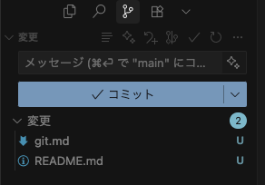
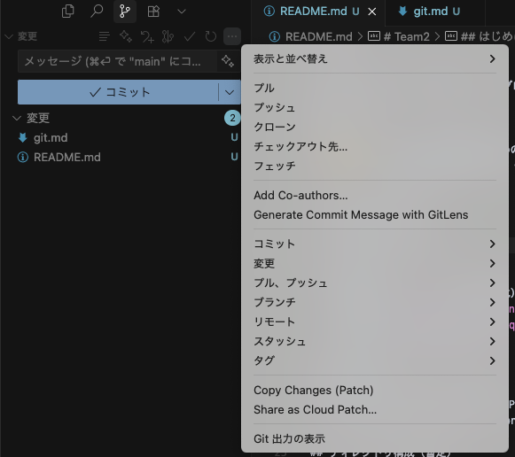

# Gitの使い方

基本的にはVSCodeのGUIで操作する。

サイドバーのメニューからGitを選択するとstaging, commitなどができる。



右上の3点リーダーからpush,pullなども選択できる



### ブランチのきりかた


### 基本的なコマンド

```bash
# すべてのファイルをステージング
$ git add .

# コミット
$ git commit -m "{COMMIT_PREFIX}: #{ISSUE_NUMBER} コミットメッセージ"
# 例
$ git commit -m "feat: #1 ユーザー登録機能を追加"

# プッシュ
$ git push
# フォースプッシュ（注意）
$ git push -f

# プル
$ git pull

# ブランチ作成
$ git checkout -b new-branch

# ブランチ切り替え
$ git checkout branch-name
```

作業ブランチで作業中にdevelopの更新を取り込みたい場合

```bash
# developブランチに切り替え
$ git checkout develop

# developブランチの最新を取得
$ git pull origin develop

# 作業ブランチに切り替え
$ git checkout new-branch

# developブランチを取り込む
$ git rebase develop
```